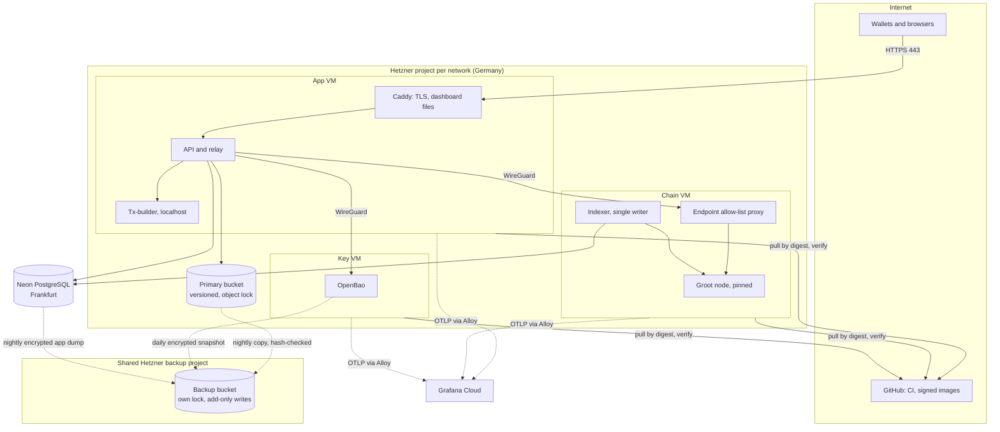

# Deployment plan

| | |
| :--- | :--- |
| **Status** | Draft (2026-10-10): the plan for the testnet alpha (M1) and the mainnet pilot (M2) |
| **Last reviewed** | 2026-10-10 |
| **Related** | [HLD §8–§13](hld.md#8-system-architecture) · [ADR 0016](adr/0016-hosting-and-environments.md) (hosting) · [ADR 0017](adr/0017-observability.md) (observability) · [ADR 0011](adr/0011-agreed-booking-terms.md) (contract deployment order) · [ADR 0014](adr/0014-contract-toolchain.md) · [Cost model](cost-model.md) · [Implementation blueprint](implementation-blueprint.md) |

How each environment is built, how contracts and services are released, what must be true before each go-live, and how we recover. The design decisions are in the ADRs; this is the order of work and the checks.

## 1. Environments

| Environment | Chain | Infrastructure | Data | Who uses it |
| :--- | :--- | :--- | :--- | :--- |
| `local` | Groot testnet, or a local chain once QPQ offer one ([ADR 0014](adr/0014-contract-toolchain.md)) | Docker Compose on a laptop: API, tx-builder, indexer, PostgreSQL, MinIO for S3, OpenBao dev mode | Throwaway | Developers |
| `testnet` | Groot testnet, our own pinned node | Hetzner project `gf-testnet` (Germany): app, chain and key VMs | Neon project (free tier), primary bucket, shared backup bucket | The testnet alpha (M1); the real-user pilot rehearsal (H3, #108) |
| `mainnet` | Groot mainnet, our own pinned node | Hetzner project `gf-mainnet`, the same shape, stricter access | Neon project (Launch plan), primary bucket, shared backup bucket | The mainnet pilot (M2), pilot cap set |

### Topology (testnet and mainnet alike)

Open ports: 443 on the app VM; the node's peer port on the chain VM; WireGuard between the three VMs; SSH by key from known addresses only. Nothing else.

## 2. Provisioning order

Everything is code: modular OpenTofu, one module per capability behind a provider-neutral interface ([ADR 0016](adr/0016-hosting-and-environments.md), guardrail 1). Built under I1 [#72](https://github.com/shanepreater/gajufreight/issues/72) (local stack) and I3 [#74](https://github.com/shanepreater/gajufreight/issues/74) (testnet environment); mainnet repeats it.

| Step | What | Module | Check before moving on |
| :-: | :--- | :--- | :--- |
| 1 | Hetzner project, private network, firewalls | `network` | Only the ports in §1 open |
| 2 | App, chain and key VMs (Debian stable, automatic security updates; the key VM without automatic reboots) | `compute` | SSH by key works; password login refused |
| 3 | WireGuard mesh between the three VMs | `network` | Each peer reaches only what it should |
| 4 | Neon project; roles per service; `read` and `app` schemas; grants (indexer writes `read` only; API can't alter `read`) | `database` | Role tests: each role can do only its job |
| 5 | Primary bucket (versioning, object lock), and the shared backup bucket (own lock; add-only credentials) | `object-storage` | Delete and overwrite refused on both; confirm object lock with Hetzner directly before real data |
| 6 | OpenBao: initialise; 3 unseal shares to 3 people (2 needed); transit engine; API policy (create, wrap, unwrap, no delete); admin deletion role; audit log | `key-service` | Seal, unseal with 2 shares, wrap and unwrap a test key; deletion refused for the API token |
| 7 | SOPS age keys generated on each host; recipients in `.sops.yaml` with the offline recovery key; service credentials encrypted | `secrets` | A host decrypts only its own files |
| 8 | Groot node at the pinned release; sync | `node` | Height matches a public node; peers > 0; finality endpoint answers |
| 9 | Grafana Alloy on each VM; Grafana Cloud stack in the best region allowed | `observability` | Host metrics and a test trace arrive; an alert test reaches the owner's phone |
| 10 | DNS for the API and dead-drop host; Caddy obtains certificates | `dns-tls` | A phone fetches a test `grids://` request over HTTPS (decision log #10) |

## 3. Contracts

In the [ADR 0011](adr/0011-agreed-booking-terms.md) order, by the deployment script ([scripted contract deployment](scripted-contract-deployment.md); C11 [#71](https://github.com/shanepreater/gajufreight/issues/71)):

1. Deploy `Platform` with the admin set and quorum.
2. Build the templates with that address substituted for `PLATFORM_ADDRESS` (`contracts/tools/build.escript --network <net>`), recording compiler commit and hashes in the manifest.
3. Deploy the `QuoteRequest` and `ShipmentEscrow` templates.
4. The admins vote `SetQuoteTemplate` and `SetEscrowTemplate`; on mainnet, also the pilot cap (`max_price`) and fee settings.
5. Commit the deployment manifest (addresses, compiler commit, source and bytecode hashes) to the repo.

**Testnet** signs with the deployer key (a SOPS secret on testnet's app VM), paid from the faucet. **Mainnet** builds each transaction unsigned and the admins sign over GRIDS, so no mainnet key is ever in automation. Live escrows are never upgraded: a fix ships as a new template, voted in.

## 4. Releasing services

1. **Merge to `main`** after the Quality gate passes.
2. **CI builds** each image (API, tx-builder, indexer, dashboard files), **signs** it with cosign keyless (Sigstore), bound to this repository's release workflow, and writes the **digests** to a release manifest.
3. **Hosts pull** the release manifest, fetch images by digest, verify signature and signing identity, and refuse anything that fails. Testnet takes every release; mainnet takes a release an admin approves.
4. **Rollback** is pulling the previous release manifest. Database migrations are backwards-compatible for one release, so the previous release still runs.

## 5. Go-live gates

### Testnet alpha (M1 exit)

- [ ] Every step in §2 done and checked, from code, on `gf-testnet`
- [ ] Contracts deployed (§3) and the manifest committed
- [ ] API, relay, tx-builder and indexer released (§4); the dashboard served
- [ ] SLIs reporting and every alert tested once ([ADR 0017](adr/0017-observability.md))
- [ ] Restore drills done once: Neon `app` dump, evidence sample, OpenBao snapshot, `read` rebuilt from the chain
- [ ] The compromised-host runbook rehearsed ([#103](https://github.com/shanepreater/gajufreight/issues/103))
- [ ] Retention periods and KYB approach set ([#151](https://github.com/shanepreater/gajufreight/issues/151)) before organisation documents are stored

### Mainnet pilot (H4 [#109](https://github.com/shanepreater/gajufreight/issues/109))

- [ ] Everything above, repeated on `gf-mainnet`
- [ ] External contract audit passed (H2 [#107](https://github.com/shanepreater/gajufreight/issues/107)); internal security review (H1 [#106](https://github.com/shanepreater/gajufreight/issues/106))
- [ ] The tx-builder's libraries pinned ([#146](https://github.com/shanepreater/gajufreight/issues/146))
- [ ] Best-endeavours legal positions reviewed with the first customers ([#45](https://github.com/shanepreater/gajufreight/issues/45))
- [ ] A second responder on call
- [ ] The pilot cap and fee settings voted in; the booking switch on
- [ ] Testnet pilot with real users complete (H3 [#108](https://github.com/shanepreater/gajufreight/issues/108))

## 6. Recovery

| Failure | Recovery | Data at risk |
| :--- | :--- | :--- |
| App VM lost | Rebuild from code; pull the current release; restore SOPS secrets with the offline recovery key if needed | None: stateless |
| Chain VM lost | Rebuild; resync the node (or restore its volume); the indexer resumes from its cursor or rebuilds `read` | None: the chain is the source |
| Key VM lost | Rebuild; restore the latest OpenBao snapshot from the backup bucket; unseal with 2 shares | Keys created since the last daily snapshot: evidence uploaded in that window is re-requested from the uploader |
| Neon data loss | Point-in-time restore; else the nightly `app` dump; rebuild `read` from the chain | Up to the restore point |
| Primary bucket lost or tampered | Copy back from the backup bucket, checking every hash | Objects since the last nightly copy: re-requested |
| Our node down | **Finality fails closed:** the indexer stops advancing and marks nothing final, and the alert fires; the dashboard shows transactions as pending. A signed transaction can still be submitted through a public node (it can't be altered, only delayed), but nothing is tracked to final until our pinned node is back. Restore it, or resync from scratch | None: projections catch up when the node returns |
| Host compromised | The [#103](https://github.com/shanepreater/gajufreight/issues/103) runbook: isolate, rotate every credential it held, rebuild from code, switch `bookings_open` off if needed | No funds are ever held by us |

Contracts can't be patched in place. For a contract bug, the admins switch `bookings_open` off so no new bookings start, and live escrows run out on their own paths (security skill).
