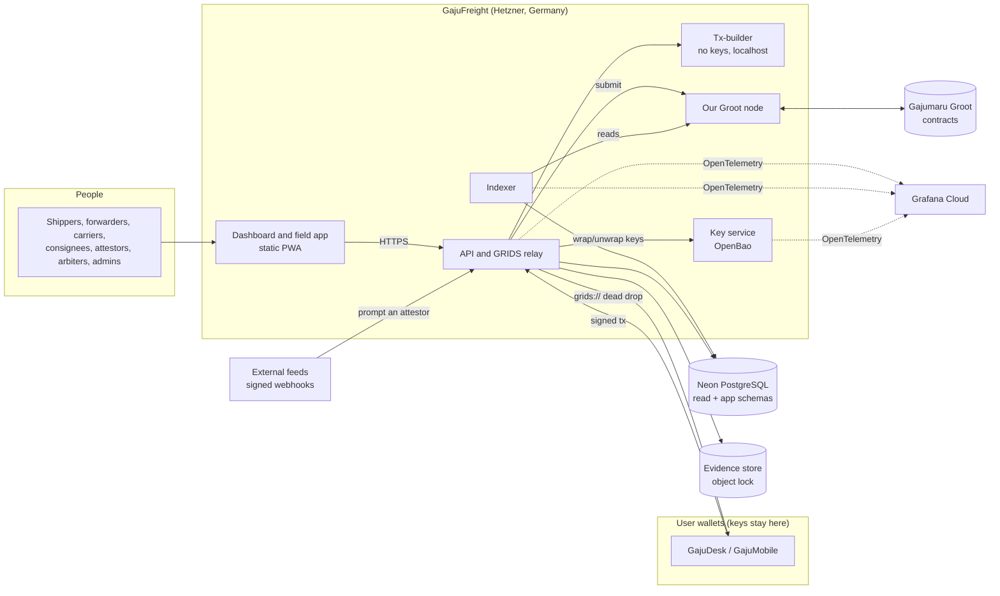
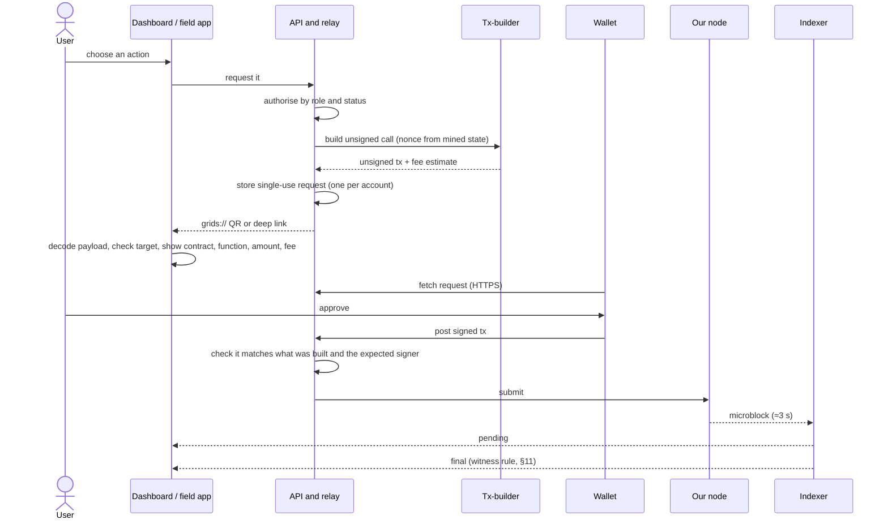
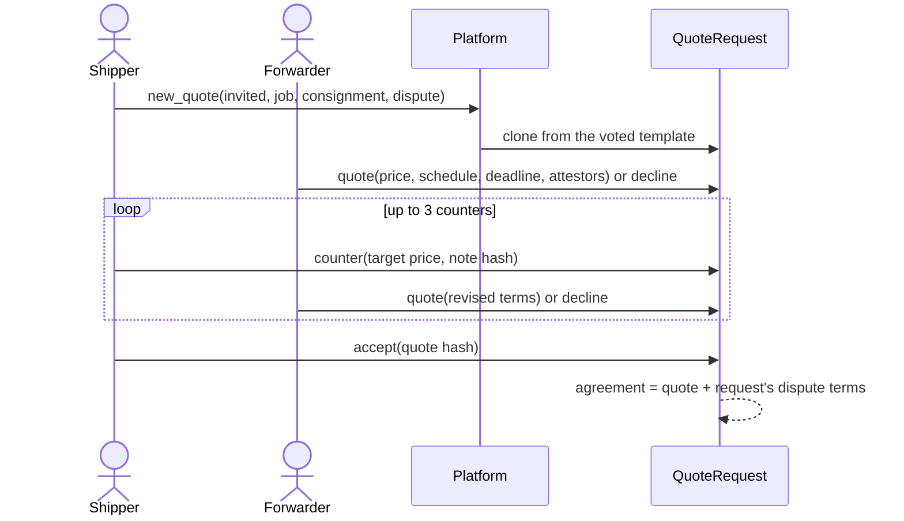
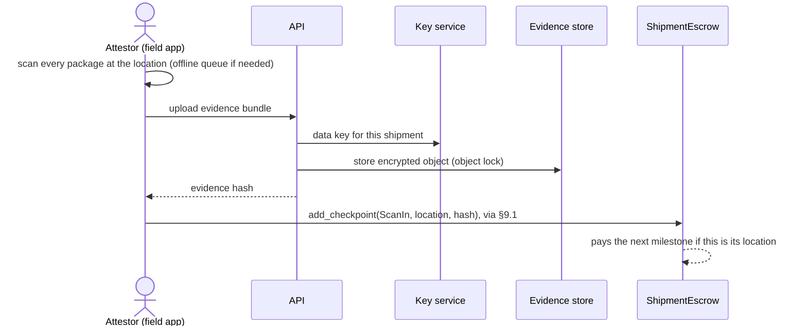

# High-Level Design: GajuFreight

| | |
| :--- | :--- |
| **Status** | Draft: the whole system for the testnet alpha (M1) and the mainnet pilot (M2) |
| **Last reviewed** | 2026-10-10 (the architecture blueprint merged in as §8–§14) |
| **Related** | [Threat model](threat-model.md) · [Decision log](decision-log.md) · [Implementation blueprint](implementation-blueprint.md) · [Development approach](dev-approach.md) · [Sources](sources.md) |

## 1. Purpose

GajuFreight is a shipment-tracking and escrow-settlement service on the Gajumaru network. This document is the whole system's design: the contracts (§3–§6), the open questions (§7), and the off-chain system, flows, data, reliability, security and deployment (§8–§14). A shipper first agrees a price with a forwarder on-chain, then locks payment in Gaju (木) against a digital waybill. Authorised parties post signed milestones as the goods move, and the payment goes to the carrier once delivery is proven. If delivery is not proven, it is refunded or sent to dispute resolution.

In practice GajuFreight is an **oracle**. It brings real-world facts ("the container reached Rotterdam", "the consignee signed for it") onto the chain, where a contract can act on them. Most of the design risk is in that step, not in moving tokens.

## 2. Scope

**The initial system** is the testnet alpha (M1) and the mainnet pilot (M2) in the [implementation blueprint](implementation-blueprint.md). **In scope:**

- Two small contracts per stage ([ADR 0004](adr/0004-staged-contracts.md)): a `QuoteRequest` for negotiating with invited forwarders, then a `ShipmentEscrow` (waybill + escrow together). Each subcontracted leg reuses the same pair between the forwarder and that leg's carrier.
- Milestone payments released by attested scan-ins, with the remainder paid on delivery.
- Milestones posted by a fixed set of *attestors* (carrier, port agent, customs broker) named when the shipment is created.
- Payment released on proof of delivery. Refund after a deadline. Disputes are settled by an M-of-N arbiter panel, with a fallback split if it deadlocks.
- Off-chain telemetry (GPS, temperature, documents). The chain holds only hashes of it.
- The off-chain system in §8: the API and GRIDS relay, tx-builder, indexer, key service, database, evidence store, dashboard and field app, and observability, hosted per [ADR 0016](adr/0016-hosting-and-environments.md).

**Out of scope (for now)**

- A dedicated freight Associate Chain (see [§6.2](#62-where-the-contract-runs)).
- Multi-currency pricing and stablecoin settlement.
- Staked or reputation-weighted attestor networks.
- Automated customs/IoT integrations beyond a signed-webhook ingest.

## 3. Actors

| Actor | Role | On-chain powers |
| :--- | :--- | :--- |
| **Shipper** | Describes the consignment and chooses the arbiter panel and dispute terms, counters and accepts a forwarder's quote, funds the escrow: the escrow's payer | Quote: `counter`, `accept`, `withdraw` ([ADR 0015](adr/0015-forwarder-led-quoting.md)). Platform: `new_quote` (with the consignment and dispute terms). Platform: `book` (books and funds in one call). Escrow: `raise_dispute`, `refund_after_deadline`, `add_attestor`, `remove_attestor` (with the payee) |
| **Forwarder** | The transport and logistics company: prices the legs and quotes the price, schedule, deadline and attestors, takes the shipment, subcontracts legs | Quote: `quote`, `decline`. The main escrow's payee: `add_checkpoint`, `raise_dispute`, `release_to_payer`, `remove_attestor` (with the payer). For each leg, the requester and payer (as the shipper above), and `settle_bond` once the main shipment ends |
| **Carrier** | Moves the goods, or one leg of them, and gets paid: a leg's payee | Quote (leg): `quote`, `decline`. Escrow: `add_checkpoint`, `raise_dispute` (not once a delivery is held), `release_to_payer`, `remove_attestor` (with the payer) |
| **Consignee** | Receives the goods. Needs no wallet when the final-mile proof of delivery is the proof (§7 Q16) | With a wallet: `confirm_delivery`, `raise_dispute`. Without one: reports problems in the app, and the shipper disputes |
| **Attestor** | Trusted third party (port, customs, surveyor), never the payee ([ADR 0006](adr/0006-final-mile-proof-of-delivery.md)) | `add_checkpoint`, `confirm_delivery` |
| **Final-mile agent** | Delivers to the consignee's door (a courier such as DPD or DHL): the last leg's carrier | Attestor on the upstream escrow, never on its own leg. Proof of delivery is a scan, photos and an optional delivery code ([ADR 0006](adr/0006-final-mile-proof-of-delivery.md)) |
| **Arbiter panel** | N independent arbiters; M must agree ([ADR 0002](adr/0002-arbiter-panel.md)) | `vote`, `resolve_by_fallback` |
| **Admin team** | Sets platform rules by M-of-N approval: limits, fee, pilot cap, booking switch, templates ([ADR 0005](adr/0005-platform-booking-privacy.md), [ADR 0011](adr/0011-agreed-booking-terms.md)) | Platform: `propose`, `approve` |
| **Anyone** | Keeps funds moving when parties don't | Escrow: `release_after_window`. Platform: `release_leg` |

## 4. Shipment lifecycle

Negotiation and execution are separate contracts ([ADR 0004](adr/0004-staged-contracts.md)). The escrow can only be created from an agreed quote, on exactly the agreed terms.

```
 Stage 1 · negotiate                          Stage 2 · execute
 Platform.new_quote → QuoteRequest           ShipmentEscrow (payer: shipper, payee: forwarder)
   (shipper posts the consignment;
    invited forwarders quote or decline;
    shipper counters ≤ 3 times, accepts) ──► created and funded in one call, on the agreed terms
                                                       │ forwarder subcontracts each leg
 QuoteRequest (forwarder ↔ carriers, per leg)  ShipmentEscrow (payer: forwarder, payee: leg carrier)
   same pattern, forwarder as requester ───► handover = the next party confirms delivery on the incoming
                                                  leg's escrow, then scans in on their own: two calls, two signatures (Q10)
```

Each escrow then follows this lifecycle:

```
  Platform.book (one call)   add_checkpoint()               confirm_delivery()
 ──────────────────► Funded ─────────────────► InTransit ─────────────────────────► Released  (payee paid)
                       │                          │  ▲          by the consignee, or by an attestor
                       │                          └──┘          whose delivery code matched
                       │                          │
                       │                          │ confirm_delivery() by an attestor, no code
                       │                          ▼
                       │                      Delivered ── release_after_window() ──► Released
                       │                          │        (anyone, after the challenge window)
                       │ raise_dispute()          │ raise_dispute() (consignee or shipper)
                       ▼                          ▼
                     Disputed ◄───────────────────┘   (also from InTransit)
                       │
                       │ vote(pct) × M matching   or   resolve_by_fallback() after the window
                       ▼
                   Resolved    (the unpaid remainder split by the panel, or by the fallback)

 Funded / InTransit ── deadline passed, no delivery ──► refund_after_deadline() ──► Refunded
 Funded / InTransit / Delivered ── the payee steps back ──► release_to_payer() ──► Refunded
```

Rules:

1. **Booking:** the payer books and funds the escrow in one call, `Platform.book`, from a quote the platform created and both sides agreed ([ADR 0005](adr/0005-platform-booking-privacy.md), [ADR 0011](adr/0011-agreed-booking-terms.md)). The agreed terms (price, schedule, deadline, attestors, panel, quorum, window, fallback, challenge window) are stored on-chain in full on the quote, and the escrow books exactly those ([decision log](decision-log.md) #4). The goods manifest and the consignee are bound by the job hash only.
2. **Checkpoints:** only the payee or a registered attestor can add one. Each stores a hash of its off-chain evidence, not the evidence itself. Package scans are one `ScanIn`/`ScanOut` checkpoint per location ([§6.6](#66-package-labels-and-custody-scanning)).
3. **Delivery:** the consignee **or** an attestor confirms it, normally the final-mile agent's proof of delivery ([ADR 0006](adr/0006-final-mile-proof-of-delivery.md)). Without that, a consignee who doesn't want to pay could hold the payee's money forever by never confirming.
4. **A held delivery:** a delivery confirmed by the consignee, or by an attestor whose delivery code matched (with every package delivered), pays the remainder in the same call. Any other attestor delivery moves to `Delivered` and holds the remainder for the agreed challenge window, during which the consignee or the shipper can dispute. After it, anyone can release it, so it can't freeze ([ADR 0006](adr/0006-final-mile-proof-of-delivery.md)).
5. **Disputes:** the payer, payee or consignee can raise one before settlement; once a delivery is held, only the consignee or the shipper can. A dispute freezes the unpaid remainder until the panel rules.
6. **Refund:** if the deadline (a block height) passes with no delivery and no dispute, the payer can reclaim the unpaid remainder. Until a refund is claimed, a late delivery can still be confirmed: the first call wins.
7. **Panel:** the dispute resolves as soon as M arbiters vote the same split. If the arbitration window passes without a quorum, any party or arbiter can apply the agreed fallback split, so a deadlocked or absent panel never freezes funds.
8. **Milestones:** each agreed `(location, pct)` pays once, in order, when an attestor signs a scan-in at that location. Delivery pays the remainder. Disputes and refunds act only on the unpaid remainder; paid milestones are final.
9. **Platform fee:** every payout to the payee of a main escrow sends GajuFreight's fee (1%, minimum 1 Gaju, never more than 10% of a payout; voted settings, fixed when the quote is requested) to the treasury, and the payee gets the rest. Refunds carry no fee. A leg's payouts carry none either, but its payer deposits a refundable bond, returned in proportion to what the parent paid its payee ([ADR 0010](adr/0010-platform-fee.md)).
10. **Stepping back:** the payee can release the escrow back to the payer at any time before settlement, which refunds the unpaid remainder ([ADR 0011](adr/0011-agreed-booking-terms.md)).
11. **Attestors:** the payer can add one after booking, never the payee. Removing one needs both payer and payee ([ADR 0006](adr/0006-final-mile-proof-of-delivery.md), [decision log](decision-log.md) #3).

## 5. Contract sketch (Sophia)

The contracts live in [`contracts/src`](../contracts/src/) and **compile on Sophia 9.0.0** (Q9) with [`contracts/tools/build.escript`](../contracts/tools/build.escript), which substitutes each network's platform address for `PLATFORM_ADDRESS` ([ADR 0014](adr/0014-contract-toolchain.md)). This section describes them; the generated [contract interface](contract-interface.md) lists every entrypoint, event, type and error code, and CI fails if it drifts from the source. It isn't tested yet: Phase 1 adds the tests. **The demo model (`scripts/demo`) still implements the earlier design** (for example, delivery always pays at once, with no `Delivered` state), so it isn't an executable reference for these contracts until C10 ([#69](https://github.com/shanepreater/gajufreight/issues/69)) aligns it. Its `QuoteRequest` already matches ([ADR 0015](adr/0015-forwarder-led-quoting.md)), and its escrow takes every term from the agreed quote and checks the job as the manifest and consignee only, as the contract does. It applies the accepted [ADR 0006](adr/0006-final-mile-proof-of-delivery.md) and [ADR 0011](adr/0011-agreed-booking-terms.md), agreed terms stored on-chain in full ([decision log](decision-log.md) #4), an optional consignee (#8), and the [design audit](design-audit.md)'s hardening. Sophia source files use the `.aes` extension.

Compiling found four bugs in the earlier, uncompiled sketch:
- a constructor name used twice: `Refunded` as an event and a status, and `Delivered` as a kind and a status;
- a one-line `switch`, which isn't valid Sophia 9;
- a datatype as an event field;
- a continuation line starting with `&&`.

**No contract calls back into one that's already running.** `Platform.book` clones the escrow, so the escrow's `init` must not call the platform: the platform passes its limits as arguments, and it does the leg accounting itself. A contract re-entering a caller further up the stack isn't verified on Gajumaru (hard rule 7), and this way the design never needs it.

### 5.1 ShipmentEscrow

One per shipment, and one per leg. It holds the money and runs the lifecycle in §4.

The source is [`contracts/src/shipment-escrow.aes`](../contracts/src/shipment-escrow.aes), and its entrypoints, events, types and error codes are in the [contract interface](contract-interface.md#shipmentescrow).

### 5.2 QuoteRequest

The negotiation stage is its own contract and never holds money ([ADR 0004](adr/0004-staged-contracts.md)). The request carries the consignment to price, and invited forwarders quote their terms (price, schedule, deadline, attestors); the agreement adds the request's dispute terms, so the full agreed terms, and what they were for, can always be read on-chain. The requester sets the arbiter panel and dispute terms, which every agreement takes from the request; the forwarder sets the price, schedule, deadline (no later than the requested deliver-by) and attestors. The requester counters with a target price, at most `max_rounds` (3) times per thread, and only the requester accepts; a forwarder can decline ([ADR 0015](adr/0015-forwarder-led-quoting.md), point 8 for who sets which term).

The source is [`contracts/src/quote-request.aes`](../contracts/src/quote-request.aes); interface: [contract interface](contract-interface.md#quoterequest).

### 5.3 Platform

Settings, templates and the registry are a third entity, controlled by an M-of-N admin multisig ([ADR 0005](adr/0005-platform-booking-privacy.md)). Every quote and escrow is a clone of a voted template, booked through the platform ([ADR 0011](adr/0011-agreed-booking-terms.md)).

The source is [`contracts/src/platform.aes`](../contracts/src/platform.aes); interface: [contract interface](contract-interface.md#platform).

### 5.4 Deploying one instance per shipment

The platform clones a voted template for every quote and escrow (`Chain.clone`, verified on testnet with value, spike E4). A clone points at the template's code and source, so a booking stores no new copy of them on-chain and costs about a third less than a full create at the escrow's size (spike [round 2](spikes/phase-0-testnet.md#round-2-2026-10-06), E14 and E18).

**Deployment order** ([ADR 0011](adr/0011-agreed-booking-terms.md)):
1. Deploy `Platform`.
2. Build the escrow template with its address in place of `PLATFORM_ADDRESS`.
3. Deploy both templates.
4. The admins vote `SetEscrowTemplate` and `SetQuoteTemplate`.

Live escrows are never upgraded. A fix ships as a new template, voted in, while existing escrows run to completion on the code they started with.

## 6. Key design decisions

### 6.1 Escrow and waybill live in the same contract

An earlier draft kept the escrow on Groot and the waybill on an Associate Chain, with Groot releasing funds "on proof from the AC". **That doesn't work as described.** According to the Un-White Paper, Groot and an Associate Chain are connected only by a value-transfer protocol (deposits and withdrawals), and Groot "does not need to know anything about what happens inside an Associate Chain". No documented mechanism lets a Groot contract read AC contract state.

Keeping the escrow and the tracking state machine in one contract, on one chain, means the release condition is checked where the funds are held.

### 6.2 Where the contract runs

| Option | Pros | Cons | When |
| :--- | :--- | :--- | :--- |
| **Groot (root chain)** | Simplest. No AC to run. Strongest finality: witness-finalised about one keyblock behind the top on mainnet ([spike round 2](spikes/phase-0-testnet.md#round-2-2026-10-06)); the depth used is a per-network setting (§7 Q17). | Groot fees for every checkpoint. | **MVP / testnet** |
| **Existing public AC** | Cheaper and faster milestones. | Depends on another AC's operators. Funds must be deposited and withdrawn. | When one is available |
| **Dedicated freight AC** | Own consensus, block times and fee policy. Can be permissioned for regulated parties. | We run operators and validators. More operational load. | Once volume or compliance needs justify it |

The contract is the same in each case. Only the deployment target changes, which keeps the decision open.

### 6.3 Trust model for attestations

On-chain logic can only be as honest as the parties who sign attestations. The MVP relies on a **named, fixed attestor set per shipment**, agreed by the shipper and carrier when the shipment is booked. Later options:

- **M-of-N attestation** before delivery counts (for example, carrier plus port agent).
- **Staked attestors** who lose their stake on a successful dispute.
- **Signed device telemetry** (tamper-evident trackers), with the signature checked off-chain and only the hash anchored on-chain.

The Un-White Paper doesn't document a native oracle primitive for Gajumaru, so the oracle role is played by attestor accounts calling the contract, as above.

### 6.4 Data on-chain vs off-chain

Status, parties, amounts, **the agreed terms in full** (price, schedule, attestors, panel and dispute terms, deadline, fee terms; [decision log](decision-log.md) #4) and **evidence hashes** go on-chain. The goods manifest and personal data go on-chain only as hashes. Raw telemetry, photos and documents are stored off-chain in a private evidence store ([ADR 0013](adr/0013-off-chain-data.md)), and the hash lets anyone holding the document check it. Checkpoints are events, not contract state, and should stay few: record milestones and one scan checkpoint per location, not GPS pings or one entry per package.

**Data TTL** sets how long a chain object stays on-chain after inclusion, as a span of block heights. Groot doesn't enforce it yet (that needs a hard fork), so it has no effect on gas or pruning today ([QPQ Q&A](qpq-q-and-a.md#data-ttl)). We don't depend on it: the escrow must never expire while it holds funds, and how a TTL is set on contract state is still a follow-up (Q2).

### 6.5 Signing and payment UX

- Parties sign with their existing Gajumaru wallets (GajuDesk / GajuMobile) using **GRIDS** QR payloads. GajuFreight never holds user keys.
- The relay tracks each transaction from pending (microblock, ≈3 s) to final by the network's rule (§9.1, §11).

### 6.6 Package labels and custody scanning

Every handling unit carries a printed QR label that only **identifies** it (`gajufreight://s/<contract>/p/<package-id>`). A label is checked against the booking `manifest` hash, then the attestor or carrier scans all units at a location and signs **one** `ScanIn` or `ScanOut` checkpoint whose evidence lists them. Missing, unknown and duplicate-sighted packages are recorded as exceptions rather than blocking the shipment. Full design: [ADR 0003](adr/0003-package-labels-and-scanning.md).

### 6.7 Staged contracts and milestones

Negotiating, executing and subcontracting are separate, small contracts ([ADR 0004](adr/0004-staged-contracts.md)). A `QuoteRequest` holds no money: invited forwarders quote, the requester counters with a target price, and only the requester accepts, exactly the terms it saw ([ADR 0015](adr/0015-forwarder-led-quoting.md)). A `ShipmentEscrow` can only be created from an agreed quote: it checks the agreement with one read-only `agreement()` call. Under [ADR 0011](adr/0011-agreed-booking-terms.md) it reads the agreed terms from the quote, where they're stored in full, instead of recomputing a hash. Each subcontracted leg is another quote and escrow between the forwarder and that leg's carrier, so every escrow conserves its own funds and the forwarder's margin is just the difference. Milestones pay on an attestor's scan-in, so no payee can release money to themselves. Today that rests on the booking not listing the payee as an attestor; [ADR 0006](adr/0006-final-mile-proof-of-delivery.md) proposes enforcing it (`CONFLICTED_ATTESTOR`).

### 6.8 Privacy standard

Everything on-chain is public. By default we keep the contracts simple and cheap, and enforce confidentiality **in the app**: screens, API responses, exports and logs are filtered by the viewer's role. We also document what remains inspectable on-chain. We don't add cryptographic hiding schemes (commit-reveal, encryption) unless that's explicitly decided ([ADR 0005](adr/0005-platform-booking-privacy.md)). Applied so far:

- **Arbiter votes** are stored in the clear. The app shows an arbiter the other votes only after they've cast their own.
- **Agreed terms are public by decision** ([decision log](decision-log.md) #4, #5). Every accepted agreement, legs included, is on-chain in full, so both parties can rely on it later. That means a chain reader can see each leg's price and the forwarder's margin. The app still shows leg prices only to the forwarder and that leg's carrier.
- **Consignments are public by decision** ([decision log](decision-log.md) #13): each request's unit lines (sizes and weights), origin, destination and deliver-by are on-chain, so competitors can read lanes and volumes. Places are UN/LOCODEs, which the contract checks, so free text such as an address is refused; the consignee and full addresses stay in the off-chain `job` hash. The request screen tells the shipper this.
- **Platform fees** are public: the fee settings, the treasury address, each quote's fee terms, every `FeePaid` event and each leg's bond and parent, so anyone can total GajuFreight's fee income and see which escrows are legs of which shipment. A zero fee alone doesn't mark a leg: fees can be voted to zero, and a refunded main escrow pays none ([ADR 0010](adr/0010-platform-fee.md)).

## 7. Open questions

Answered questions move into the design above and keep their row here as a record. Protocol questions go to the QPQ dev team (asked 2026-10-03). Their answers and our follow-up questions are in the [QPQ Q&A](qpq-q-and-a.md). The Phase 0 spike verifies each answer on testnet before the contracts rely on it.

| # | Question | Status | Why it matters |
| :-: | :--- | :--- | :--- |
| 1 | Is `Chain.clone` available on Gajumaru FATE (testnet and mainnet), and what does it cost compared with a full deployment? | **Partly answered (QPQ):** a clone pays only for its own state and `init`, not the code. Availability, gas and funding a clone are [follow-ups](qpq-q-and-a.md#contract-cloning). **Verified on testnet ([spike](spikes/phase-0-testnet.md) E4, E11):** `Chain.clone` works from a contract, funded in the same call; a clone shares its template's bytecode hash. **Costed in [round 2](spikes/phase-0-testnet.md#round-2-2026-10-06) (E14, E18):** a 4.4 KB escrow cost 2.23 × 10¹⁴ puck to create and 2.01 × 10¹⁴ to clone. A call's fixed charge outweighs a create's at small sizes, so clones save about a third only at full escrow size. | Per-shipment cost; fallback in [§5.4](#54-deploying-one-instance-per-shipment) |
| 2 | Data TTL: what is the API, and does it apply to contract state or only to some transaction types? | **Partly answered (QPQ):** a span of block heights from inclusion, not yet enforced on Groot (needs a hard fork). How to set it on contract state is a [follow-up](qpq-q-and-a.md#data-ttl). | Whether settled shipment state can be pruned ([§6.4](#64-data-on-chain-vs-off-chain)) |
| 3 | Smallest Gaju denomination: its name and decimal precision? | **Answered (QPQ):** the puck; 10¹⁸ puck = 1 Gaju, so the demo's placeholder holds ([Q&A](qpq-q-and-a.md#denomination)). | Amount types end to end |
| 4 | Is there a public testnet we can deploy to? | **Answered 2026-10-02 (QPQ):** yes. Deploy with GajuDesk and pay gas from the faucet ([ecosystem reference §4](ecosystem-reference.md#4-deploying-contracts-to-testnet)). Whether a public AC testnet exists is still open; the MVP doesn't need one. | MVP deployment target |
| 5 | Arbitration model? | **Decided 2026-10-03:** an M-of-N arbiter panel with a deadline fallback ([ADR 0002](adr/0002-arbiter-panel.md)) | Dispute entrypoints and UI |
| 6 | Protected accounts (Travel Rule co-signing): does `Chain.spend` to a protected carrier account need a co-signature, fail, or queue? | **Answered (QPQ):** Groot has no protected accounts, so `Chain.spend` payouts can't stall there. They exist only on Associate Chains, under that AC's rules ([Q&A](qpq-q-and-a.md#protected-accounts)). **Verified on testnet ([spike](spikes/phase-0-testnet.md) E6):** payouts arrive with no co-signature. A contract payee must be `payable`, or the payout fails and burns the gas (E6b). | Payouts could stall |
| 7 | Is there a maintained client for the node HTTP API (submit transactions, read microblocks and contract events)? What are the public endpoints and spec? | **Partly answered (QPQ):** no SDK; the node's HTTP API is the interface, with Hakuzaru's `hz` module as the best reference. Public endpoints are listed. Reading events and microblocks, and finality, are [follow-ups](qpq-q-and-a.md#node-api). **Verified on testnet ([spike](spikes/phase-0-testnet.md) E7, E8):** events are read from `/transactions/{hash}/info` and recognised by name hash; agreement hashes can be rebuilt off-chain. **[Round 2](spikes/phase-0-testnet.md#round-2-2026-10-06):**<br>• The node publishes its OpenAPI spec at `/api`.<br>• Testnet's node pushes SSE (contract events and calls, top header, balances) and reports finality per transaction; mainnet's older node does neither yet.<br>• No public endpoint encodes FATE, and no rate limits were seen.<br>• A clone's `init` events appear in the booking transaction's log (E15). | Indexer and API ([ADR 0001](adr/0001-python-fastapi-uv-workspace.md)) |
| 8 | What is the GRIDS payload format for *contract calls* (not only spends), and how does GajuDesk/GajuMobile show it before signing? | **Partly answered (QPQ):** the payload is the unsigned call data; the wallet returns the signed and unsigned data and its public key. A safer request format (chain, contract, function, args) is coming. Transport and wallet display are [follow-ups](qpq-q-and-a.md#grids). **Verified with GajuDesk 0.9.0 ([round 2](spikes/phase-0-testnet.md#round-2-2026-10-06), E9):**<br>• A dead-drop URL delivers the request.<br>• The wallet POSTs the signed transaction back, and the service submits it.<br>• A payable call, a funded create and a sign-in message all worked.<br>• The dialog shows raw transaction data only (no contract, function or amount).<br>GajuMobile 0.2.1 (Android emulator, [spike E9b](spikes/phase-0-testnet.md#e9b-gajumobile-2026-10-06)): the same, plus deep links work; it fetches only over HTTPS, and it can't sign offline. | The API builds unsigned calls (hard rule 1) |
| 9 | Which Sophia compiler version do GajuDesk and the testnet support? | **Answered (QPQ):** Sophia 9.0.0, the version packaged with GajuDesk ([Q&A](qpq-q-and-a.md#sophia)). **Verified ([spike](spikes/phase-0-testnet.md) E1):** probes compile on 9.0.0 and deploy from GajuDesk. | Pinning `@compiler` |
| 10 | Can one GRIDS request carry several contract calls, signed once? | **Answered (QPQ): no.** One instruction per GRIDS message, so a handover takes two signatures ([Q&A](qpq-q-and-a.md#batching)). **Tested ([round 2](spikes/phase-0-testnet.md#round-2-2026-10-06), E16):** a wrapper contract can't batch them either, because the callees see the wrapper, not the signer, as `Call.caller`. | A handover is the next leg's scan-in plus the incoming leg's delivery ([ADR 0004](adr/0004-staged-contracts.md)) |
| 11 | Roughly what gas does a simple contract call (e.g. a quote `propose`) cost on testnet and mainnet? | **Partly answered (QPQ):** gas varies with payload size, TTL, storage and computation; no figure yet. A ballpark and gas estimation are [follow-ups](qpq-q-and-a.md#fees), and the spike measures it. **Measured on testnet ([spike](spikes/phase-0-testnet.md) E5, E10):** a small call ≈ 3,700 gas, a payout ≈ 9,000, at 10⁹ puck per gas plus a size fee; `/dry_run` gives an exact estimate before signing. **[Round 2](spikes/phase-0-testnet.md#round-2-2026-10-06) (E17, E18):**<br>• 10⁹ puck/gas is the enforced floor.<br>• Unused gas isn't charged.<br>• Every call carries a fixed charge of about 182,600 gas (≈ 0.00018 Gaju a call) that `/dry_run` doesn't include, so the fee shown must add it. | Showing the fee before each negotiation round |
| 12 | Can a contract be created **with value** (payable `init`), and can a contract create another (`Chain.create`)? | **Answered (QPQ): yes to both.** A create transaction carries an amount, and a contract can create or clone another ([Q&A](qpq-q-and-a.md#contract-creation)). **Verified on testnet ([spike](spikes/phase-0-testnet.md) E2–E4), with a change:** in `init`, `Call.value` is 0 and `Contract.balance` holds the amount, so funding checks read the balance. | Atomic booking and `Platform.new_quote` ([ADR 0005](adr/0005-platform-booking-privacy.md)) |
| 13 | How many Pucks (the smallest unit) make one Gaju? | **Answered (QPQ):** 10¹⁸ (see Q3). | Amount display and input (relates to Q3) |
| 14 | Consolidated shipments: one master shipment with final-mile legs, or a hub master with a child shipment per order? | **Deferred to FOC** (2026-10-06, [decision log](decision-log.md) #1); the spike runs then ([ADR 0007](adr/0007-consolidated-shipments.md)) | Bulk shipping of many orders |
| 15 | Should an organisation act on-chain through one org-level contract that delegates to its current members, instead of individual addresses? It covers attesting **and** every other party role: requester, invitee, payer and payee are single addresses, so staff with their own wallets can't quote, accept or fund for the company ([design audit](design-audit.md) F8) | **Decided for the MVP** (2026-10-06, [decision log](decision-log.md) #7): each company names one operating wallet for quotes, escrows and payouts; handlers attest with their own wallets. The org contract is FOC work, and QPQ are asked how GajuPay models it ([Q&A](qpq-q-and-a.md#organisations)) | Handlers who join after booking can't attest; staff can't act for the company without its key |
| 16 | Must every consignee have a Gajumaru wallet? `init` takes the consignee's address, and only a party can dispute. Door-to-door parcel deliveries (ADR 0006, 0007) imply consignees with no wallet, reached by email or SMS | **Decided** (2026-10-06, [decision log](decision-log.md) #8): **no.** When the final-mile proof of delivery is the proof, the consignee is optional on-chain. A consignee without a wallet gets the delivery code and tracking by email and reports problems in the app, and the shipper raises the dispute ([ADR 0006](adr/0006-final-mile-proof-of-delivery.md)) | Who can confirm or dispute delivery; what contact data the app holds |
| 17 | How many keyblocks make a transaction final on Groot mainnet, and how does a client detect a dropped microblock? `/status` reports `finalized` at genesis on testnet | **Partly answered by test ([round 2](spikes/phase-0-testnet.md#round-2-2026-10-06)):**<br>• Mainnet finalises by witness: `finalized` is at top − 1, and key blocks carry testimonies.<br>• Testnet has no witnesses, so it relies on depth: `/transactions/{h}/finality` returns `on_chain` with a depth.<br>**QPQ (2026-10-08):** a transaction in generation G is final once key block G + 1 is sealed by a majority of witness testimonies, i.e. when `finalized` ≥ G + 1. A micro-fork means waiting 2 more key blocks, and a netsplit shows as missing testimonies ([Q&A](qpq-q-and-a.md#node-api)).<br>N stays a per-network setting where there are no witnesses. The day-long fork watch (E13) is pending | Pending vs final in the UI, indexer reorg depth, alert thresholds |

**Still open** (2026-10-10): QPQ's answers to the 2026-10-09 chase (a local chain, the safer GRIDS call request, production nodes and HTTPS, the iOS date: [Q&A](qpq-q-and-a.md#round-2-findings-and-questions)); the dashboard and field-app framework ([#49](https://github.com/shanepreater/gajufreight/issues/49)); the signing, notification and operating-wallet journeys ([#58](https://github.com/shanepreater/gajufreight/issues/58)–[#60](https://github.com/shanepreater/gajufreight/issues/60)); and the retention periods and KYB approach ([#151](https://github.com/shanepreater/gajufreight/issues/151)).

## 8. System architecture

The contracts in §4–§6 are half the system. This section is the other half: what runs off-chain, where, and how the two meet. The off-chain side never holds user keys: every value-moving action is signed in the user's own wallet over GRIDS (hard rule 1).

### 8.1 Context



### 8.2 Components

| Component | Job | Technology and where it runs | Decided in |
| :--- | :--- | :--- | :--- |
| **Contracts** | Money and status: `Platform`, `QuoteRequest`, `ShipmentEscrow` (§4–§5) | Sophia 9 on Groot, built from pinned sources | [ADR 0004](adr/0004-staged-contracts.md), [0011](adr/0011-agreed-booking-terms.md), [0014](adr/0014-contract-toolchain.md), [0015](adr/0015-forwarder-led-quoting.md) |
| **API** | Authorises every request by role and shipment status; builds unsigned transactions; evidence ingest; organisations, directory, sessions, notifications, feedback | Python 3.14 and FastAPI, stateless, on the app VM | [ADR 0001](adr/0001-python-fastapi-uv-workspace.md), [0008](adr/0008-app-sessions.md), [0009](adr/0009-organisations-and-directory.md) |
| **GRIDS relay** | Serves each signing request at a single-use dead-drop URL, checks the signed transaction against what was built, submits it and tracks it to final; one open request per account | Part of the API | [ADR 0012](adr/0012-transaction-building-and-grids-relay.md) |
| **Tx-builder** | Builds unsigned calls and creates with a fee estimate, FATE-hashes values, decodes events | Erlang sidecar on Hakuzaru and the Sophia compiler, localhost only, no keys | [ADR 0012](adr/0012-transaction-building-and-grids-relay.md) |
| **Indexer** | Follows our node, projects contract events into the `read` schema, marks pending and final, handles micro-forks | Python, a single writer per network, on the chain VM beside the node | [ADR 0013](adr/0013-off-chain-data.md), [ADR 0016](adr/0016-hosting-and-environments.md) |
| **Groot node** | Our own view of the chain, at a known version | Pinned release on the chain VM; its API reached only over WireGuard | [ADR 0016](adr/0016-hosting-and-environments.md) |
| **Key service** | Keys per environment, data class and shipment for evidence; erasure by key deletion | OpenBao (transit) on its own key VM | [ADR 0013](adr/0013-off-chain-data.md), [ADR 0016](adr/0016-hosting-and-environments.md) |
| **Database** | `read`: chain projections (rebuildable). `app`: organisations, members, verification, contacts, sessions, GRIDS requests, wrapped evidence keys, audit log (system of record) | Neon serverless PostgreSQL, Frankfurt | [ADR 0013](adr/0013-off-chain-data.md), [ADR 0016](adr/0016-hosting-and-environments.md) |
| **Evidence store** | Evidence bundles, photos, documents and every on-chain hash's preimage, encrypted per object | Hetzner Object Storage with versioning and object lock, plus a locked backup bucket | [ADR 0013](adr/0013-off-chain-data.md), [ADR 0016](adr/0016-hosting-and-environments.md) |
| **Dashboard and field app** | Every screen; shows the GRIDS QR or deep link for anything that needs a signature; decodes each payload itself before showing it | Static PWA served by Caddy on the app VM; framework open (#49) | [ADR 0003](adr/0003-package-labels-and-scanning.md), [ADR 0008](adr/0008-app-sessions.md) |
| **Observability** | Traces, metrics and logs; SLIs; alerts that page the owner | OpenTelemetry via an agent on each VM, into Grafana Cloud's free tier | [ADR 0017](adr/0017-observability.md) |
| **External feeds** | Carrier, port and tracker events | Signed webhooks into the API; they only prompt an attestor to sign (hard rule 5) | [Threat model](threat-model.md) T14 |

### 8.3 Trust boundaries

1. **The chain is authoritative** for funds and shipment status. The `read` schema is a cache; the `app` schema holds only what the chain doesn't (ADR 0013).
2. **Wallets are authoritative** for identity. No GajuFreight service holds a user's key.
3. **Attestors are trusted per shipment.** Their powers are limited to the addresses each escrow names (§6.3).
4. **External feeds are untrusted.** They can only prompt an attestor to sign; they never change on-chain state.
5. **The API enforces every rule the UI shows.** Every endpoint authorises the caller by role and shipment status, for reads as well as writes, and builds no GRIDS payload for an action the caller can't take. The contract checks again on-chain.
6. **Hosts trust nothing by network location.** The node and the key service are reached only over WireGuard, by key; hosts run only images whose signature and digest they've verified ([ADR 0016](adr/0016-hosting-and-environments.md)).

The full analysis, with each threat's controls and owning issue, is the [threat model](threat-model.md); its residual risks R1–R5 are accepted (decision log #18).

### 8.4 Technology

| Layer | Choice | Why |
| :--- | :--- | :--- |
| Contracts | Sophia on FATE, Sophia 9.0.0 built from pinned mirrors | The only contract language on Gajumaru; byte-identical to GajuDesk's compiler ([ADR 0014](adr/0014-contract-toolchain.md)) |
| Services | Python 3.14, FastAPI, Pydantic, one uv workspace | Typed validation and one lockfile ([ADR 0001](adr/0001-python-fastapi-uv-workspace.md)) |
| Transaction building | Erlang sidecar on QPQ's Hakuzaru and Sophia, as dependencies | No SDK exists; reuses QPQ's encoders ([ADR 0012](adr/0012-transaction-building-and-grids-relay.md)) |
| Dashboard | Installable PWA (camera, offline queue, WebAuthn) | Renders GRIDS payloads, so no wallet integration; framework by #49 |
| Data | Neon PostgreSQL; S3-compatible object storage with object lock; OpenBao for keys | Managed database, cheap durable storage, crypto-shredding ([ADR 0013](adr/0013-off-chain-data.md), [ADR 0016](adr/0016-hosting-and-environments.md)) |
| Platform | Hetzner Cloud VMs, WireGuard, Caddy, Docker Compose; modular OpenTofu; cosign | Lowest cost that can scale, portable by design ([ADR 0016](adr/0016-hosting-and-environments.md)) |
| Observability | OpenTelemetry, Grafana Cloud | Free to start, vendor-neutral ([ADR 0017](adr/0017-observability.md)) |

## 9. Key flows

### 9.1 Signing anything (the GRIDS loop)

Every on-chain action, from a quote to a vote, goes through the same loop ([ADR 0012](adr/0012-transaction-building-and-grids-relay.md)).



### 9.2 Agreeing a price



Each arrow is one §9.1 loop. Forwarders see only requests they're invited to; the consignment and dispute terms are public on-chain (§6.8).

### 9.3 Booking and funding

The API stores the manifest and consignee (the job hash's preimage) before building the booking. Then `Platform.book(quote, manifest, consignee)`, signed by the shipper with the price attached, clones the escrow, which reads every term from the agreement and starts `Funded` (§4, rule 1). One signature creates and funds it.

### 9.4 Custody scans and milestone payouts



The field app queues the scan and its evidence offline and asks for the signature once there's signal; it never claims "signed" before the wallet has posted (ADR 0012 decision 5).

### 9.5 Delivery

The final-mile agent proves delivery with a scan, photos and the consignee's delivery code ([ADR 0006](adr/0006-final-mile-proof-of-delivery.md)). With a matching code, `confirm_delivery` pays the remainder at once; without one, the escrow holds it in `Delivered` for the agreed challenge window, then anyone can release it. A consignee with a wallet can confirm instead.

### 9.6 Disputes

Before settlement, a party raises a dispute, which freezes the unpaid remainder. Arbiters review the evidence in the app (each sees others' votes only after voting) and vote a split; the first M matching votes resolve it. If the window passes without a quorum, anyone can apply the agreed fallback split (§4, rule 7).

### 9.7 Erasure

A data subject's erasure request is approved in the app, and a separate admin role deletes that shipment's key in the key service. Every wrapped data key for that shipment, and so every encrypted object, version, replica and backup, becomes unreadable once the key service's 30-day snapshots expire. The locked ciphertext is deleted when its lock lapses; on-chain hashes remain, resolving to nothing ([ADR 0013](adr/0013-off-chain-data.md), decision log #21, #22).

## 10. Data

| Store | Holds | System of record? | Rebuilt from | Protection | Backup |
| :--- | :--- | :--- | :--- | :--- | :--- |
| **Groot** | Agreements in full, status, payouts, votes, evidence hashes, consignments | Yes | — | Public by design (§6.8) | The chain |
| **`read` schema** | Projections of chain events | No | The chain | Role-scoped access | Neon point-in-time restore; can be rebuilt |
| **`app` schema** | Organisations, members, verification and audit log, contacts, sessions, GRIDS requests, wrapped evidence keys | Yes | — | Role per service; encrypted at rest | Neon point-in-time restore, nightly encrypted dump, quarterly restore test |
| **Evidence store** | Bundles, photos, documents, hash preimages | Yes | — | Per-object envelope encryption; object lock | Locked backup bucket with separate add-only credentials; monthly restore check |
| **Key service** | Keys per environment, data class and shipment | Yes | — | Sealed at rest; 2-of-3 unseal | Daily encrypted snapshot, 30-day retention; quarterly restore drill |
| **Telemetry** | Metrics, logs and traces: ids and hashes only | No | — | No personal data | 14-day retention |

Personal data never goes on-chain; agreed terms always do (hard rule 4).

## 11. Reliability, observability and non-functional requirements

- **Finality:** "pending" at microblock inclusion (≈3 s), "final" when the network's rule is met. On mainnet a transaction in generation G is final once key block G + 1 is witness-sealed (`finalized` ≥ G + 1); with no witness record, nothing is final (fail closed). Networks without witnesses use a depth of 3 key blocks, from a 24-hour fork watch (§7 Q17).
- **Dropped transactions:** the relay re-posts a signed transaction that falls out before final, unchanged, while its TTL lasts; abandoned requests lapse in about an hour and never block an account (ADR 0012).
- **SLIs, alerts and paging:** every sre-skill SLI has a metric; alerts page the owner on what users or funds feel ([ADR 0017](adr/0017-observability.md)).
- **Recoverability:** every host is rebuilt from code; `read` from the chain; `app`, evidence and keys from their backups ([§10](#10-data)).
- **Security:** no custodial keys; role-checked entrypoints; evidence verified against its hash on every read; TLS everywhere (WireGuard inside).
- **Cost:** checkpoints are milestones only; bulk telemetry stays off-chain. Hosting is tens of pounds a month per environment ([ADR 0016](adr/0016-hosting-and-environments.md)).
- **Auditability:** every on-chain status change names its signer and links its evidence hash; the `app` schema's audit log records admin and verification actions.

## 12. Security

Beyond the trust boundaries in §8.3:

- **Keys we hold:** none of users'. The testnet deployer key is a SOPS secret on testnet's app VM; mainnet deployments are signed by admin wallets over GRIDS, so no mainnet key is ever in automation. OpenBao's unseal shares are held 2-of-3 by people, not machines.
- **Supply chain:** the compiler is built from full commit hashes; the tx-builder's libraries are pinned before production ([#146](https://github.com/shanepreater/gajufreight/issues/146)); images are signed with cosign and pulled by digest.
- **Showing what's signed:** wallets show raw data, so the dashboard decodes every payload and checks its target before showing the QR ([#91](https://github.com/shanepreater/gajufreight/issues/91)); the safer GRIDS call request will make this the wallet's job (residual risk R1).
- **Accepted residual risks:** R1–R5 in the [threat model](threat-model.md#residual-risks-accepted-2026-10-09).

## 13. Deployment

| Environment | Chain | Runs on | Purpose |
| :--- | :--- | :--- | :--- |
| `local` | Testnet or a local chain (ADR 0014) | Docker Compose on a laptop | Development |
| `testnet` | Groot testnet, our own pinned node | App, chain and key VMs on Hetzner; Neon free tier | The testnet alpha (M1) and the real-user pilot rehearsal (H3) |
| `mainnet` | Groot mainnet, our own pinned node | The same shape, separate projects; Neon Launch | The mainnet pilot (M2), with the pilot cap set |

Contracts are deployed in the ADR 0011 order (§5.4): testnet by the deployment script with the deployer key, mainnet by admin wallets over GRIDS. Live escrows are never upgraded. Hosting, secrets and the node are [ADR 0016](adr/0016-hosting-and-environments.md); CI runs the Quality gate on every pull request.

## 14. Decisions

| ADR | Decision | Status |
| :--- | :--- | :--- |
| [0001](adr/0001-python-fastapi-uv-workspace.md) | Python and FastAPI in one uv workspace (the tx-builder excepted) | Accepted |
| [0002](adr/0002-arbiter-panel.md) | M-of-N arbiter panel with a fallback split | Accepted |
| [0003](adr/0003-package-labels-and-scanning.md) | Package labels and scan in/out custody | Accepted |
| [0004](adr/0004-staged-contracts.md) | Staged contracts: negotiation, execution, legs | Accepted (negotiation amended by 0015) |
| [0005](adr/0005-platform-booking-privacy.md) | Platform, atomic booking, privacy standard | Accepted (round limit amended by 0015) |
| [0006](adr/0006-final-mile-proof-of-delivery.md) | Final-mile proof of delivery and challenge window | Accepted |
| [0007](adr/0007-consolidated-shipments.md) | Consolidated shipments | Proposed; deferred to FOC |
| [0008](adr/0008-app-sessions.md) | Sign-in sessions for a shift | Accepted |
| [0009](adr/0009-organisations-and-directory.md) | Organisations, sign-up and directory | Accepted (retention and KYB: #151) |
| [0010](adr/0010-platform-fee.md) | Platform fee from payee payouts; leg bonds | Accepted |
| [0011](adr/0011-agreed-booking-terms.md) | Agreed terms on-chain; booking through the platform | Accepted |
| [0012](adr/0012-transaction-building-and-grids-relay.md) | Tx-builder sidecar and GRIDS relay | Accepted |
| [0013](adr/0013-off-chain-data.md) | Read model, operational store, evidence store | Accepted |
| [0014](adr/0014-contract-toolchain.md) | Contract toolchain and test harness | Accepted (test chain provisional) |
| [0015](adr/0015-forwarder-led-quoting.md) | Forwarder-led quoting | Accepted |
| [0016](adr/0016-hosting-and-environments.md) | Hetzner with Neon and OpenBao, in Germany | Proposed |
| [0017](adr/0017-observability.md) | Grafana Cloud, SLIs and alerting | Proposed |

Smaller decisions are in the [decision log](decision-log.md).
